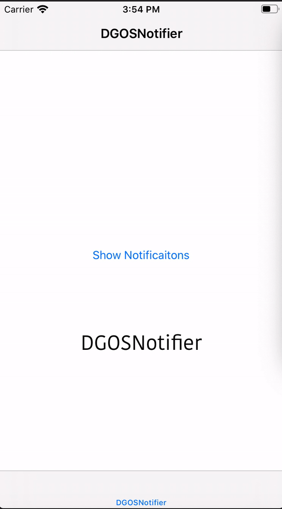
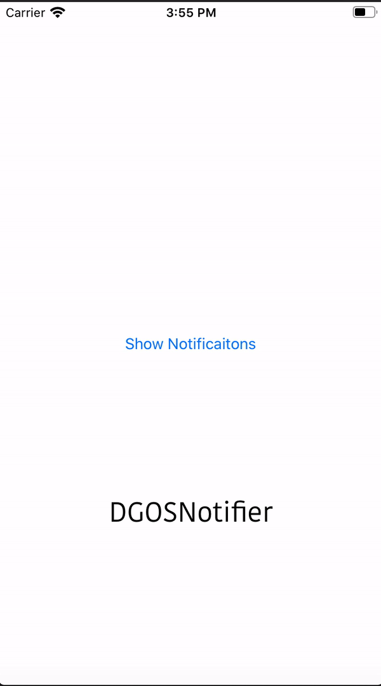
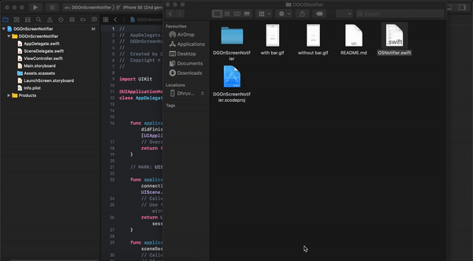

# DGOSNotifier

A lightweight extension library which allows you to show on screen notification after completion of a task.

### Preview

#### with and without Navigation bar and Tab bar

#### without Navigation bar and Tab bar

## Features

* Eyes Boggling Entry and Exit in Screen
* Safe Layout Guided
* Multiline Label
* 30 X 30 Notification Icon
* Fully Customizable
* Light Weight
* Drop once use Anywhere

## Installation

1. **Clone** the Project
2. **Drag and Drop** [OSNotifier.swift](https://github.com/DhruvGovani/DGOSNotifier/blob/master/OSNotifier.swift) in your project directory 
3. Make sure **Add to target** is marked
4. You are **ready** to go.

## Usage

### Setup

**in Your** [Viewcontroller.swift](https://github.com/DhruvGovani/DGOSNotifier/blob/master/DGOnScreenNotifier/ViewController.swift)

Declare Before viewDidLoad()
 
    
    let NotificationView = UIView()
    
   Inside the viewDidLoad()

    NotificationView.frame = .zero

    self.view.addSubview(NotificationView)

   
### Quick Example
Now use initOSNotifier method of UIView to initialize the notifier

    NotificationView.initOSNotifier(ParantView: self.view, Text: "Label text here", Icon: #imageLiteral(resourceName: "imageName"), BackgroundColor: .black, AppearFrom: .top, TextColor: .white)

Now use showOSNotifier() to show the notification

    NotificationView.showOSNotifier(to: .top, ParantView: self.view)

make sure direction parameter must remain same either **.top** or **.bottom**

## More

For more run [DGOnScreenNotifier.xcodeproj](https://github.com/DhruvGovani/DGOSNotifier/tree/master/DGOnScreenNotifier.xcodeproj "DGOnScreenNotifier.xcodeproj") project in xcode.

##  License

[DGOSNotifier](https://github.com/DhruvGovani/DGOSNotifier) is released under the MIT license. See [LICENSE](https://github.com/DhruvGovani/DGOSNotifier/blob/master/LICENSE)

